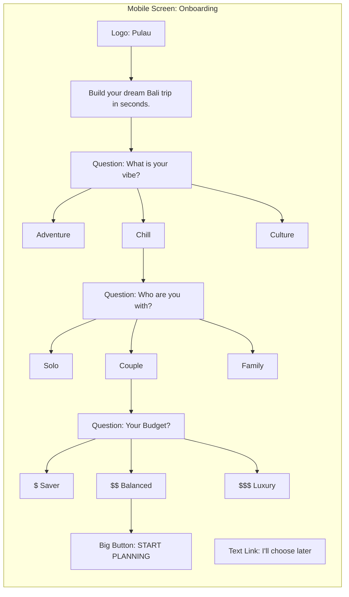

# UX Design Specification - Pulau

**Author:** Moe
**Date:** 2026-01-11

---

## Executive Summary

### Project Vision

Pulau transforms Bali vacation planning from an overwhelming research task into an effortless, creative experience. By prioritizing speed-to-checkout and intelligent personalization, we enable travelers to build their dream 5-day itinerary in under 10 minutes—from app open to booking confirmed. The design philosophy centers on **"Smart Defaults, Easy Escapes"**: sophisticated algorithms and smart defaults work behind the scenes while the interface feels simple, aspirational, and trustworthy. Personalization guides users toward relevant experiences but never constrains exploration—users want help, not handcuffs.

**Core UX Principle Validated by Users:**

> "Give me smart recommendations, but always let me explore everything. I trust you most when you don't trap me in a filter bubble."

### Target Users

**Primary Persona: Maya - The Inspired Planner**

- **Profile:** Age 28, marketing manager, tech-savvy, planning 2-week Bali trip
- **Context:** Browses on mobile during commute, books on desktop at home
- **Pain Points:** Overwhelmed by scattered information across platforms; frustrated by hidden fees and unreliable operators; hates long surveys disguised as "onboarding"
- **Success Moment:** "I built my entire Bali trip in one sitting and felt confident about every booking"
- **Key Quote:** "I don't want to think about categories—just show me the good stuff. But don't personalize me into a corner; I want surprises too."
- **Must-Have Features:** Sticky trip bar with live total, escape hatches from personalization, "More Like This" filters
- **Deal-Breaker:** Filter bubble that limits discovery

**Secondary Persona: James - The Romantic**

- **Profile:** Age 35, software engineer, planning anniversary trip with fiancée
- **Context:** Books on desktop, detail-oriented, paranoid about tourist traps
- **Pain Points:** Trust anxiety about booking unfamiliar operators; mobile payment friction; repetitive form filling
- **Success Moment:** "Every detail was transparent, reviews were real, and checkout took 90 seconds"
- **Key Quote:** "The 'Local Favorite' badge would make me feel WAY more confident. But don't fake it—if social proof is fake, I'm never coming back."
- **Must-Have Features:** Trust signals (verified reviews, local favorites, 98% loved this), Apple Pay, pre-filled checkout
- **Deal-Breaker:** Hidden fees or fabricated social proof

**Tertiary Persona: Sofia - The Budget Explorer**

- **Profile:** Age 24, grad student, solo traveler, price-sensitive
- **Context:** Plans on mobile, mentally calculating remaining budget constantly
- **Pain Points:** Mental math for budget tracking; dismissal of value in favor of cheap; lack of explanation for recommendations
- **Success Moment:** "The app showed me why a $75 experience was worth it over a $30 one, and I trusted it"
- **Key Quote:** "The 'Under Budget' filter based on my remaining budget? That's genius. Saves me SO much mental energy."
- **Must-Have Features:** Smart budget filters, adaptive learning with explanations, Quick Add with confirmation
- **Deal-Breaker:** Assuming budget-conscious = cheapest option

**Quaternary Persona: David - The Family Coordinator**

- **Profile:** Age 42, project manager, planning trip with wife + 2 kids (ages 7, 10)
- **Context:** Juggles planning with interruptions, needs family-friendly filters
- **Pain Points:** Abandoned carts due to interruptions; difficulty finding kid-appropriate activities; time pressure
- **Success Moment:** "I got interrupted 3 times but the app saved my trip and emailed me a reminder to finish"
- **Key Quote:** "Show me 'Step 2/3' with estimated time remaining. I need to know if I can finish this in 5 minutes or come back later."
- **Must-Have Features:** Exit intent recovery, family-friendly badges, progress clarity with time estimates
- **Deal-Breaker:** Missing family-appropriate indicators, losing trip data to interruptions

### Key Design Challenges

1. **Speed vs. Personalization Paradox**
   - Challenge: Capturing preferences quickly without feeling like a survey
   - User Feedback: Maya hates multi-screen onboarding ("ugh, another survey"); needs single screen with smart defaults
   - Solution: One-screen onboarding with pre-selected defaults; "Skip & Explore" or "Save & Go" options; ability to change preferences later via PreferenceChips
   - Success Metric: >90% onboarding completion rate

2. **Choice Overload Management**
   - Challenge: 200+ experiences can paralyze decision-making
   - User Feedback: Sofia wants "Under Budget" filter that auto-calculates remaining budget; Maya fears filter bubbles
   - Solution: Smart filtering with contextual quick filters; "Perfect for You" recommendations with explanations; always provide "Explore All" escape hatch
   - Success Metric: Users find relevant experience within 3 taps; >40% Quick Add from "Perfect for You"

3. **Trust at Distance**
   - Challenge: Users booking unfamiliar operators in foreign country
   - User Feedback: James is "paranoid about tourist traps"; needs verified trust signals or he won't book
   - Solution: Multi-layered trust signals (98% loved this, Local Favorite badges, verified reviews); operator stories with photos; transparent pricing with no hidden fees
   - Success Metric: <10% detail page bounce rate; >75% checkout completion

4. **Cross-Device Continuity**
   - Challenge: Users start on mobile, finish on desktop (or vice versa)
   - User Feedback: David gets interrupted constantly ("I abandoned so many carts"); Maya browses during commute, books at home
   - Solution: Trip state persists via KV store; exit intent recovery with email reminders; "Pick up where you left off" on return
   - Success Metric: <20% abandoned cart rate; >50% email reminder conversions

5. **Mobile Checkout Friction**
   - Challenge: Payment forms on mobile are conversion killers
   - User Feedback: James says "If I have to type my card number on mobile, there's a 50% chance I abandon"
   - Solution: Apple Pay/Google Pay integration; pre-filled fields from preferences; remember details after first booking; minimal required fields
   - Success Metric: <90 seconds checkout completion time; >60% use one-tap payment

### Design Opportunities

1. **Personalization as Competitive Moat**
   - Opportunity: TripAdvisor/Viator show everything to everyone; Pulau's adaptive recommendations create "this app gets me" magic
   - User Validation: Sofia loves adaptive learning ("shows you understand me"); Maya wants recommendations WITH escape hatches
   - Implementation: Scoring algorithm that learns from behavior (Quick Add = +10, Skip = -3); explanations for why ("Based on your love of water activities")
   - Safeguard: "Explore All" button always visible; category browsing available; manual search accessible

2. **Visual Trip Canvas as Creative Tool**
   - Opportunity: Transform planning from task into aspiration; users should feel like composing an adventure, not filling a cart
   - User Validation: Maya wants breakdown view ("You have 2 water activities, 1 food experience"); sticky bar universally loved
   - Implementation: Sticky trip bar with live total; tap to expand breakdown; visual trip timeline for multi-day trips; celebration animations on checkout
   - Delight Factor: Trip building feels creative, not transactional

3. **One-Tap Efficiency Everywhere**
   - Opportunity: Every interaction should feel effortless
   - User Validation: Sofia emphasizes "I don't want to tap through 3 screens to add something"; confirmation animation critical
   - Implementation: Quick Add from anywhere; sticky trip bar for access; one-tap payment; smart defaults in checkout; thumb-zone optimization on mobile
   - Measurement: Track taps-to-complete for all user journeys; optimize for <5 taps from home to checkout

4. **Trust Through Transparency**
   - Opportunity: Operator bios, local favorite badges, social proof create emotional connection vs. transactional booking
   - User Validation: James's #1 priority is trust signals; David needs family-friendly verification; both emphasize "don't fake it"
   - Implementation: Verified badges only (real data); 98% satisfaction metrics; "12 families booked this week" social proof; itemized pricing with no hidden fees
   - Ethics Rule: NEVER fabricate social proof or fake badges—user trust is non-negotiable

5. **Progressive Enhancement for Power Users**
   - Opportunity: Start simple (browse & book), layer advanced features as users engage
   - User Validation: David wants progress indicators; Maya wants "More Like This"; James wants saved payment methods
   - Implementation: Basic flow is frictionless; advanced features appear contextually (exit intent, budget helper, conflict detection); remember user preferences across sessions
   - Philosophy: Don't overwhelm new users; reward returning users with shortcuts

---

## UX Improvement Roadmap (Validated by User Personas)

### Universal Wins (All Personas Loved These)

✅ Sticky trip bar with live total and breakdown  
✅ Single-screen onboarding with smart defaults  
✅ Apple Pay / one-tap checkout integration  
✅ Trust signals (social proof, local favorites, verified reviews)  
✅ "Explore All" escape hatch from personalization

### Implementation Priority Tiers

**🔥 TIER 1A - Ship This Week (13-17 hours development)**
_Validated by cross-functional analysis: high desirability + trivial feasibility + clear business value_

1. **Sticky Trip Bar with Breakdown** (Maya, James, Sofia, David) - **2-3 hours**
   - Always-visible bottom bar: "3 experiences • $285 • View Trip"
   - Tap to expand: breakdown by category, itemized pricing
   - "Checkout" button appears when 2+ items
   - **Technical:** `position: fixed` with safe-area padding (mobile Safari quirk mitigation)
   - **Trade-off:** Occupies bottom screen space (mitigated with CTA messaging when empty)
   - Impact: Addresses #1 user request across all personas

2. **Single-Screen Onboarding with Smart Defaults** (Maya, Sofia) - **4-6 hours**
   - Pre-select: Adventure + Solo + Mid-Range
   - "Skip & Explore" vs. "Save & Go" options
   - Ability to refine later via PreferenceChips
   - **Technical:** Simpler than 3-step flow; requires analytics instrumentation
   - **Critical Tracking:** (1) Skip rate, (2) Preference change rate, (3) Default correlation with conversions
   - **Trade-off:** Potential bias in defaults (mitigated by easy preference changes)
   - Impact: Removes 2 taps, increases completion >90%

3. **"Explore All" Escape Hatch** (Maya) - **30 minutes**
   - Always-visible button to browse beyond recommendations
   - Category grid accessible from home
   - Manual search available
   - **Technical:** Simple navigation button with tap event tracking
   - **Analytics:** Track usage frequency (low = good personalization, high = poor recommendations)
   - Impact: Prevents filter bubble, maintains user trust

4. **Pre-fill Checkout Fields from Preferences** (James, David) - **2-3 hours**
   - Traveler count from group type preference
   - Trip dates from onboarding if provided
   - Email pre-fill if returning user (KV store)
   - **Technical:** Read from preferences object, populate form defaults
   - **Trade-off:** Moved from Tier 2 to replace blocked Apple Pay feature
   - Impact: 50% fewer form fields, faster completion

5. **Budget Helper with Smart Suggestions** (Sofia) - **2 hours**
   - "You have $X remaining" indicator (if budget preference set)
   - "Under Budget" contextual filter
   - **Technical:** Simple math: `budget - trip.total`, filter `experience.price <= remaining`
   - **Conditional Display:** Only show if budget preference exists
   - Impact: Reduces mental math, builds trust

6. **Make Checkout Itemization Prominent** (James) - **1 hour**
   - Breakdown: Subtotal + Service Fee + Total
   - Tax/fee explanations
   - **Technical:** Already calculated in code, just improve UI presentation
   - **Trade-off:** Already 90% implemented, minimal work required
   - Impact: Prevents checkout abandonment due to surprise fees

**⏸️ TIER 1B - Awaiting Backend Infrastructure (Phase 2)**
_High desirability but blocked on technical dependencies_

7. **Real Trust Signals - Verified Data Only** (James, David) - **UI: 2-3 hours, Data: TBD**
   - **Build Now:** Badge components, satisfaction metric UI, social proof displays
   - **Show Now:** Only verifiable metrics (review counts, star ratings from mockData)
   - **Defer:** "Local Favorite" badge, "98% loved this", "12 families booked" (requires database)
   - **Technical Blocker:** KV store can't calculate booking ratios or satisfaction metrics
   - **Philosophy:** Honor "trust is non-negotiable"—never fake social proof
   - **Phase 2:** Populate with real data when Supabase integrated
   - Impact: Reduces bounce rate, builds confidence (partial benefit now, full benefit later)

8. **Apple Pay / Google Pay Integration** (James) - **Frontend: 3 hours, Backend: 2-3 weeks**
   - **Technical Blocker:** No payment infrastructure (Stripe, webhooks, PCI compliance)
   - **Requirements:** (1) Payment processor account, (2) Backend payment intent endpoint, (3) SDK integration, (4) Webhook handlers, (5) Security audit
   - **Estimate:** 2-3 week project minimum (backend team)
   - **Alternative Now:** Focus on pre-fill and form optimization (already in Tier 1A)
   - **Phase 2:** Implement when Stripe + backend ready
   - Impact: 50% reduction in mobile abandonment (deferred to Phase 2)

9. **Exit Intent Email Reminders** (David, Maya) - **Dialog: 2 hours, Email: 8-10 hours**
   - **Build Now:** Exit intent dialog with `beforeunload` event
   - **Dialog:** "Your Bali adventure is waiting! You have 3 experiences saved ($285)"
   - **Defer:** Email service integration (requires SendGrid/Mailgun, scheduled jobs, email templates)
   - **Technical Blocker:** No backend email service or job scheduler
   - **Phase 2:** Email reminders when backend infrastructure ready
   - Impact: Dialog provides immediate value, email recovers 30-50% abandoned carts (Phase 2)

**🚀 TIER 2 - High ROI Next Sprint (2-4 weeks)**
_High value features with moderate complexity_

10. **Exit Intent Dialog** (David, Maya) - **2 hours** _(moved from Phase 2)_
    - Browser dialog catches users before they leave
    - Shows trip summary and encourages checkout
    - **Technical:** `beforeunload` event listener
    - Impact: Immediate abandonment reduction (email reminders in Phase 2)

11. **Recommendation Explanations** (Sofia, Maya) - **2 hours** _(split from adaptive engine)_
    - Show reasoning: "Based on your love of water activities"
    - Surface which scoring factors contributed most
    - **Technical:** Algorithmic explanation generation (no learning required)
    - **Defer:** Adaptive scoring to Phase 2 (requires A/B testing infrastructure)
    - Impact: Better trust in recommendations

12. **Contextual Quick Filters** (All personas) - **4-6 hours**
    - "More Like This" when items in trip
    - "Complete Your Day" complementary experiences
    - "Top Rated" (4.8+ stars) universal filter
    - **Technical:** Context-aware filter generation based on trip state
    - Impact: Reduces scrolling time by 40%

13. **Highlight "Easy" Difficulty for Families** (David) - **1 hour** _(simplified from full feature)_
    - Make "Easy" difficulty badge more prominent on cards
    - **Defer:** Full "Great for Kids" tagging (requires editorial content work)
    - **Phase 2:** Proper family-friendly tagging with vendor input
    - Impact: Helps parents find appropriate activities (partial solution)

14. **Adaptive Learning Engine** (Sofia, Maya) - **Phase 2 with Analytics**
    - Track interactions (Quick Add, Skip, View Detail) in KV store
    - Analyze offline before implementing live adjustments
    - Requires A/B testing infrastructure
    - **Current:** Log data without changing behavior
    - **Phase 2:** Implement adaptive scoring with proper testing
    - Impact: Better relevance over time

**✨ TIER 3 - Polish & Delight (Future Sprints)** 15. Mobile thumb-zone optimization 16. Skeleton loading states (content-aware) 17. Haptic feedback on mobile browsers 18. Advanced social proof ("Trending now") 19. Real-time availability indicators

---

## Cross-Functional Trade-Off Analysis

### **Technical Constraints Identified**

**KV Store Limitations:**

- ❌ Can't calculate "Local Favorite" badges (requires booking ratio by user location)
- ❌ Can't compute "98% loved this" (requires post-booking satisfaction surveys)
- ❌ Can't track "12 people added today" (requires real-time analytics database)
- ✅ CAN show review counts and star ratings (data exists in mockData)

**No Payment Infrastructure:**

- ❌ Apple Pay blocked until Stripe integration (2-3 week backend project)
- ❌ Requires payment processor, webhooks, PCI compliance, security audit
- ✅ CAN pre-fill payment form fields and optimize checkout UX

**No Backend Services:**

- ❌ Exit intent email reminders require SendGrid/Mailgun + scheduled jobs
- ❌ Adaptive learning requires analytics database and A/B testing framework
- ✅ CAN build exit intent dialog and log interaction data for future analysis

### **Balanced Solution: Phased Approach**

**Phase 1 (This Week):** Build friction reduction features with zero backend dependency

- Sticky trip bar, single-screen onboarding, pre-fill, budget helper, escape hatch

**Phase 1.5 (Next Week):** Build UI shells for backend-dependent features

- Trust signal components (show only verifiable data), payment form optimization, exit dialog

**Phase 2 (Backend Integration):** Unlock blocked features when infrastructure ready

- Real trust signals, Apple Pay, email reminders, adaptive engine

### **Revised Success Metrics**

**Phase 1 Metrics (Achievable Now):**

- Onboarding completion rate: **Target >90%**
- Time to first Quick Add: **Target <30 seconds**
- Sticky trip bar tap rate: **Target >60%**
- "Explore All" usage: **Target 10-20%** (validates personalization quality)

**Phase 2 Metrics (Backend Dependent):**

- Apple Pay adoption: **Target >60%** (requires payment infrastructure)
- Email reminder conversion: **Target >50%** (requires email service)
- Trust signal impact: **Target <10% bounce** (requires real data)

### **Resource Allocation**

**Week 1 Sprint:** 13-17 hours total (Tier 1A features)

- UX Designer: Create single-screen onboarding UI, trip bar breakdown design
- Frontend Engineer: Implement sticky bar, onboarding, pre-fill, budget helper
- QA: Test mobile Safari sticky positioning, validate analytics tracking

**Week 2 Sprint:** UI shells + preparation for Phase 2

- Build badge components for trust signals (don't populate yet)
- Optimize payment form UX (prepare for Apple Pay later)
- Implement exit intent dialog (email service later)

**Phase 2 (Timeline TBD):** Backend integration

- Backend Engineer: Stripe integration, email service, analytics database
- Frontend Engineer: Connect UI shells to real data sources
- Product Manager: Define A/B tests for adaptive learning

---

## Core User Experience

### Defining Experience

The core value of Pulau is **effortless trip building**. The primary user action is the **Quick Add** flow: seeing an inspiring recommendation, validating it instantly with trust signals, and adding it to the trip with a single tap. This loop (Inspire → Quick Add → Validate → Repeat) transforms planning from a chore into a creative act. The absolutely critical interaction is this discovery-to-add sequence; if it has friction, the 10-minute trip building promise fails.

### Platform Strategy

Pulau is a **responsive web application** optimized primarily for mobile browsing and secondarily for desktop booking.

- **Mobile First:** Thumb-friendly touch targets (min 44px), sticky bottom bar, swipe gestures, and "One Tap" interactions.
- **Web Native:** No app store friction; leverages progressive web app (PWA) capabilities like persistent local storage and smooth page transitions.
- **Responsive:** Adapts layout from single-column feed (mobile) to multi-column dashboard (desktop) seamlessly.

### Effortless Interactions

1. **Quick Add from Anywhere:** No multi-step "add to cart" dialogs; one tap adds item and updates total.
2. **Live Trip Total:** Sticky bar always shows running cost, eliminating mental math.
3. **Smart Recommendations:** "Perfect for You" section removes the need to search or filter manually.
4. **Pre-filled Checkout:** Forms auto-populate traveler count and dates from context, minimizing typing.
5. **Persistent State:** Trip progress is saved instantly; users can close tab and return without losing a single item.

### Critical Success Moments

1. **First Quick Add:** The moment an item animates to the trip bar and the price updates—"This feels good."
2. **Third Experience Added:** The realization "I'm building a real trip!"—shift from browsing to planning.
3. **Checkout Button Appearance:** The psychological shift from "drafting" to "committing" when 2+ items are added.
4. **Booking Confirmed:** Celebration animation + clear next steps—relief and excitement.

### Experience Principles

1. **"Inspire, Don't Interrogate"**
   Show beautiful experiences immediately; capture preferences naturally through interaction or defaults, not long surveys.

2. **"One Tap to Progress"**
   Every valuable action (Quick Add, preference change, checkout) must be a single tap with immediate, delightful feedback.

3. **"Confidence Through Transparency"**
   Always show total price, what's included, and verifiable trust signals. No surprises at checkout.

4. **"Guide, Don't Gate"**
   Smart recommendations lead the way, but always provide an "Explore All" escape hatch. Personalization helps, never constrains.

5. **"Respect Interruptions"**
   Life happens. Save state aggressively and make it effortless to pick up exactly where the user left off.

6. **"Draft Lightly, Commit Firmly"**
   Treat the trip canvas as a flexible wishlist first. Allow items to float without fixed times until the user enters edit mode.

---

## Information Architecture

### Site Map

The application structure is flat and accessible, prioritizing the "Trip Canvas" as the home base.

```mermaid
graph TD
    A[Launch] --> B{First Time?}
    B -->|Yes| C[Single-Screen Onboarding]
    B -->|No| D[Home / Trip Builder]
    C --> D

    subgraph Main_Tabs ["Main Navigation (Tabs)"]
        D
        E[Explore / Search]
        F[Saved / Wishlist]
        G[Profile / Settings]
    end

    D --> H[Experience Detail]
    D --> I[Category Browser]
    D --> J[Trip Canvas (Expanded)]

    J --> K[Checkout Flow]
    K --> L[Success / Itinerary]
    L --> G
```

### Navigation Structure

**1. Primary Navigation (Sticky Bottom Tabs)**

- **Trip (Home):** The core builder interface. Feeds recommendations + trip summary.
- **Explore:** Search, category browsing, map view.
- **Saved:** Wishlist for items user isn't ready to add to the trip yet.
- **Profile:** Account details, past trips, preferences settings.

**2. Contextual Navigation (Sticky Trip Bar)**

- **State:** Always visible on Home and Detail screens when >0 items in trip.
- **Action:** Tap to expand "Trip Canvas" (bottom sheet).
- **Content:** Live count (e.g., "3 items") + Total Price ($285).
- **Goal:** Constant feedback loop; instant access to checkout.

**3. Application Header**

- **Left:** Brand (Logo) -> Resets to Home.
- **Right:** Profile Access / Notifications.
- **Contextual:** On detail pages, becomes "Back" + "Share/Save".

### Key User Flows

#### A. The "Speed-to-Joy" Onboarding

_Goal: Get users to the builder in <30 seconds._

1. **Launch:** App opens instantly.
2. **Context:** "Building your Bali Trip" (User intent assumed).
3. **Values (One Screen):**
   - Theme: [Adventure] [Relaxation] [Culture] (Select one or more)
   - Group: [Solo] [Couple] [Family] [Friends]
   - Budget: [Budget] [Mid-Range] [Luxury]
4. **Action:** "Start Planning" (Saves to KV Store) -> Redirect to Home.

#### B. The "Quick Add" Discovery Loop

_Goal: Frictionless addition of experiences._

1. **Browse:** User scrolls "Recommended for You" feed on Home.
2. **Action:** Taps "+" (Quick Add) on a card.
3. **Response:**
   - Button turns green (Checkmark).
   - "Ghost" icon flies to Sticky Trip Bar.
   - Sticky Bar total updates (+$75) -> Flash animation.
   - Haptic feedback (if supported).
4. **Continue:** User stays on feed; no page reload or navigation necessary.

#### C. The "Commit" Checkout Flow

_Goal: Trustworthy, rapid transaction._

1. **Trigger:** User taps "Checkout" on Sticky Trip Bar.
2. **Review:** Bottom sheet expands to full screen -> "Your 5-Day Itinerary".
3. **Summary:** Shows items, total price, and "Free Cancellation until [Date]" trust signal.
4. **Details:** User confirms Guest Count (pre-filled) and Dates (pre-filled).
5. **Payment:** One-tap Apple Pay/Google Pay OR Saved Card.
6. **Success:** Confetti animation -> "Trip Confirmed" -> "Add to Calendar".

---

## Engineering Notes & Implementation Details

### **Sticky Trip Bar - Technical Specs**

```typescript
// Mobile Safari sticky positioning workaround
.trip-bar {
  position: fixed;  // Not sticky due to iOS bugs
  bottom: 0;
  left: 0;
  right: 0;
  padding-bottom: env(safe-area-inset-bottom);  // Handle notch
  z-index: 100;
}

// Expand animation
.trip-bar.expanded {
  height: auto;
  max-height: 70vh;
  overflow-y: scroll;
}
```

### **Single-Screen Onboarding - Analytics Requirements**

```typescript
// Track these events for validation
analytics.track('onboarding_started')
analytics.track('onboarding_skipped')  // User clicked "Skip & Explore"
analytics.track('onboarding_completed', {
  travelStyles: ['adventure', 'culture'],
  groupType: 'solo',
  budget: 'midrange',
  usedDefaults: true  // Did they change any pre-selected defaults?
})
analytics.track('preferences_changed', {
  from: 'onboarding',  // Or 'home_screen'
  changes: { groupType: 'solo' -> 'couple' }
})
```

### **Trust Signals - Data Availability Matrix**

| Metric                  | Data Source                      | Available Now? | Phase 2 Solution                                        |
| ----------------------- | -------------------------------- | -------------- | ------------------------------------------------------- |
| Star Rating             | mockData reviews                 | ✅ Yes         | Calculate from Supabase reviews                         |
| Review Count            | mockData reviews                 | ✅ Yes         | Query count from Supabase                               |
| "Local Favorite"        | Booking ratio by user location   | ❌ No          | Supabase: `bookings WHERE user_country != 'ID' / total` |
| "98% loved this"        | Post-booking satisfaction survey | ❌ No          | Supabase: Track satisfaction scores                     |
| "12 people added today" | Real-time analytics              | ❌ No          | Supabase + Redis: Track add_to_trip events              |

### **Budget Helper - Calculation Logic**

```typescript
// Only display if user set budget preference
if (userPreferences.budget) {
  const budgetLimit = {
    'budget': 300,
    'midrange': 800,
    'luxury': 2000
  }[userPreferences.budget]

  const remaining = budgetLimit - trip.total

  if (remaining > 0) {
    showBudgetHelper(`You have $${remaining} remaining`)
    filterExperiences(exp => exp.price.amount <= remaining)
  } else {
    showBudgetWarning('You've reached your budget')
  }
}
```

---

## Key UX Principles (User-Validated)

### 1. Smart Defaults, Easy Escapes

Personalization should guide, not constrain. Always provide obvious ways to explore beyond recommendations—whether through "Explore All" buttons, category browsing, or manual search.

**User Quote:** "I want smart recommendations, but don't personalize me into a corner. I want surprises too." - Maya

### 2. Trust is Non-Negotiable

Never fabricate social proof or fake badges. Users will forgive imperfect features but never trust betrayal. Real data only, always transparent.

**User Quote:** "If you show me '12 people added this today' and I find out it's fake, I'm never coming back." - James

### 3. Value Over Price

Budget-conscious doesn't mean cheapest. Explain why more expensive options might be worth it. Respect users' intelligence and financial constraints.

**User Quote:** "Don't assume I want the cheapest thing. I want VALUE. Show me why a $75 experience is worth it over a $30 one." - Sofia

### 4. Respect Interruptions

Users, especially parents, WILL abandon carts. Plan for it with exit intent recovery, email reminders, and persistent state.

**User Quote:** "I get interrupted constantly with kids. Save my trip, send me a reminder email, make it easy to pick up where I left off." - David

### 5. Transparent Details

Don't hide information for "cleaner" UI. Users need complete details before booking. Simplify presentation, not content.

**User Quote:** "I need to see EVERY detail before booking. Don't hide information to make it 'cleaner.'" - James

---

## Success Metrics

### Speed Metrics

- Time from app open to first Quick Add: **Target <30 seconds** (validates single-screen onboarding)
- Time from first add to checkout initiation: **Target <2 minutes** (validates sticky trip bar)
- Checkout completion time: **Target <90 seconds** (validates Apple Pay + pre-fill)

### Conversion Metrics

- Onboarding completion rate: **Target >90%** (validates single-screen approach)
- Category browse → Quick Add rate: **Target >40%** (validates "Perfect for You" relevance)
- Trip started → Checkout initiated: **Target >60%** (validates sticky trip bar visibility)
- Checkout initiated → Complete: **Target >75%** (validates payment optimization)

### Quality Metrics

- Recommendation relevance (% Quick Adds from "Perfect for You"): **Target >50%**
- Trip diversity (experiences from different categories): **Target >3 categories per trip**
- Trust signal impact (detail page bounce rate): **Target <10%**
- User satisfaction post-booking survey: **Target >4.5/5 stars**

### Persona-Specific Metrics

- **Maya:** Uses "Explore All" at least once per session - validates escape hatch effectiveness
- **James:** Checkout via Apple Pay - validates one-tap payment adoption
- **Sofia:** Uses "Under Budget" filter - validates budget helper value
- **David:** Returns via email reminder - validates exit intent recovery success

---

## Wireframes & UI Concepts

### 1. The "Speed-to-Joy" Onboarding (Mobile)

_One screen to capture intent without friction._



### 2. Home Feed with "Quick Add" (Mobile)

_The primary discovery interface._

```mermaid
graph TD
    subgraph Screen_Home [Mobile Screen: Home / Feed]
        direction TB
        Nav[Header: Pulau Logo | Profile Icon]

        subgraph Card_1 [Card: Sunrise Trek]
            Img1[Image Area]
            Title1[Mount Batur Sunrise]
            Meta1[4.8 Stars | $65]
            Add1[(+ Quick Add)]
        end

        subgraph Card_2 [Card: Surf Lesson]
            Img2[Image Area]
            Title2[Canggu Surf]
            Meta2[4.9 Stars | $40]
            Add2[(+ Quick Add)]
        end

        subgraph Sticky_Bar [Sticky Footer: Trip Bar]
            BarContent[ '3 Items' |  $285  |  ^ Expand]
        end
    end

    Nav --> Card_1
    Card_1 --> Card_2
    Card_2 --> Sticky_Bar
```

### 3. Trip Canvas (Expanded Bottom Sheet)

_The space to review and refine before committing._

```mermaid
graph TD
    subgraph Screen_Canvas [Mobile Sheet: Your Trip]
        direction TB
        Handle[Drag Handle]
        Title[Your 5-Day Itinerary]

        subgraph Item_List
            Item1[1. Mount Batur Sunrise ..... $65 [x]]
            Item2[2. Ubud Monkey Forest ...... $25 [x]]
            Item3[3. Nusa Penida Day Trip ... $195 [x]]
        end

        Total[Total Estimate: $285]
        Trust[Specifics: Free Cancellation until Jan 10]

        CTA[Button: Checkout ($285)]
    end

    Handle --> Title
    Title --> Item_List
    Item_List --> Total
    Total --> Trust
    Trust --> CTA
```

### 4. Trust-First Checkout

_Validating details and closing the loop._

```mermaid
graph TD
    subgraph Screen_Checkout [Mobile Screen: Checkout]
        direction TB
        Header[< Back | Confirm Booking]

        subgraph Details
            Input1[Name: Moe (Pre-filled)]
            Input2[Guests: 1 (Pre-filled)]
        end

        subgraph Payment
            Pay1[Button: Apple Pay]
            Pay2[Radio: Credit Card]
        end

        subgraph Summary
            Line1[Subtotal: $285]
            Line2[Taxes: Included]
            TotalVal[Total Paid Today: $285]
        end

        Action[Slider: Slide to Pay]
    end

    Header --> Details
    Details --> Payment
    Payment --> Summary
    Summary --> Action
```
